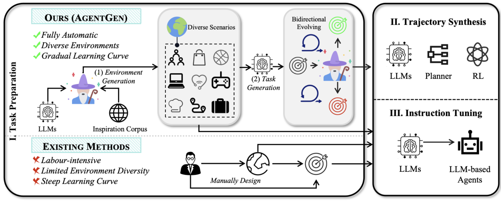

# ✨ AgentGen: Enhancing Planning Abilities for Large Language Model based Agent via Environment and Task Generation

[](https://arxiv.org/abs/2408.00764)
[](https://opensource.org/licenses/MIT)
[](https://www.python.org/)
<!-- [](https://github.com/AgentGen2024E/AgentGen/actions) -->
<!-- [](https://github.com/AgentGen2024E/AgentGen/issues) -->
<!-- [](https://github.com/AgentGen2024E/AgentGen/stargazers) -->
<!--  -->

<p align="center">
  
</p>


<!-- ## 📋 Table of Contents
- [🤖 AgentGen: Enhancing Planning Abilities for Large Language Model based Agent via Environment and Task Generation](#-agentgen-enhancing-planning-abilities-for-large-language-model-based-agent-via-environment-and-task-generation)
  - [📋 Table of Contents](#-table-of-contents)
  - [📢 Updates](#-updates)
  - [🛠️ Installation](#️-installation)
  - [🚀 Quick Start](#-quick-start)
  - [🧪 Experiments](#-experiments)
  - [📦 Model \& Dataset](#-model--dataset)
  - [🙏 Acknowledgement](#-acknowledgement) -->

## 📢 Updates

- **2025/05**: Checking our new [Text2World](https://arxiv.org/abs/2502.13092) paper on PDDL generation accepted by ACL 2025 Findings.
- **2024/12/11**: Initial release the code

## 🛠️ Installation

1. Configure the environment:
```bash
conda env create -f environment.yml
conda activate agentgen
```

2. Set up OpenAI credentials:
   - Add your `OPENAI_API_KEY` to `src/key.txt`

3. Install required dependencies ([pddlgym](https://github.com/tomsilver/pddlgym) and [pddlgym_planners](https://github.com/ronuchit/pddlgym_planners)):
```bash
pip install pddlgym
# for mac:
# brew install coreutils
git clone https://github.com/ronuchit/pddlgym_planners.git
cd pddlgym_planners
pip install -e .
```

## 🚀 Quick Start

Generate the environment and domain for the first iteration:
```bash
cd src
bash run.sh
``` 

## 🧪 Experiments

This repository provides our implementation to reproduce the data generation process described in the original AgentGen paper. To replicate the results:

1. Segment the `src/data/inpiration_corpus/lima.json`
2. Run the `run.sh` script iteratively

For additional components:
- **Model Training**: We use [llama-factory](https://github.com/hiyouga/LLaMA-Factory/tree/main)
- **Model Evaluation**: We use [AgentBoard](https://github.com/hkust-nlp/AgentBoard/tree/main/agentboard)

## 📦 Model & Dataset

- **Dataset**: Our reproduced dataset after iterative environment and task generation is available in the `src/data/it12` folder
- **Model**: We followed the training configuration from the original paper to reproduce the models (We trained the AgentGen-8B model with alpaca template since there exists a bug when training with llama-3 template):

| Model | Huggingface Repo |
|-------|-----------------|
| AgentGen-70B-Lora-Rank1 | [🤗 Huggingface](https://huggingface.co/DannyShaw/AgentGen-70B-Lora-Rank1) |
| AgentGen-70B-Lora-Rank16 | [🤗 Huggingface](https://huggingface.co/DannyShaw/AgentGen-70B-Lora-Rank16) |
| AgentGen-8B | [🤗 Huggingface](https://huggingface.co/DannyShaw/AgentGen-8B) |

## 🙏 Cite
If you find this repo helpful in your research, please cite the original paper:

```bibtex
@article{hu2024agentgen,
  title={Agentgen: Enhancing planning abilities for large language model based agent via environment and task generation},
  author={Hu, Mengkang and Zhao, Pu and Xu, Can and Sun, Qingfeng and Lou, Jianguang and Lin, Qingwei and Luo, Ping and Rajmohan, Saravan and Zhang, Dongmei},
  journal={arXiv preprint arXiv:2408.00764},
  year={2024}
}
```